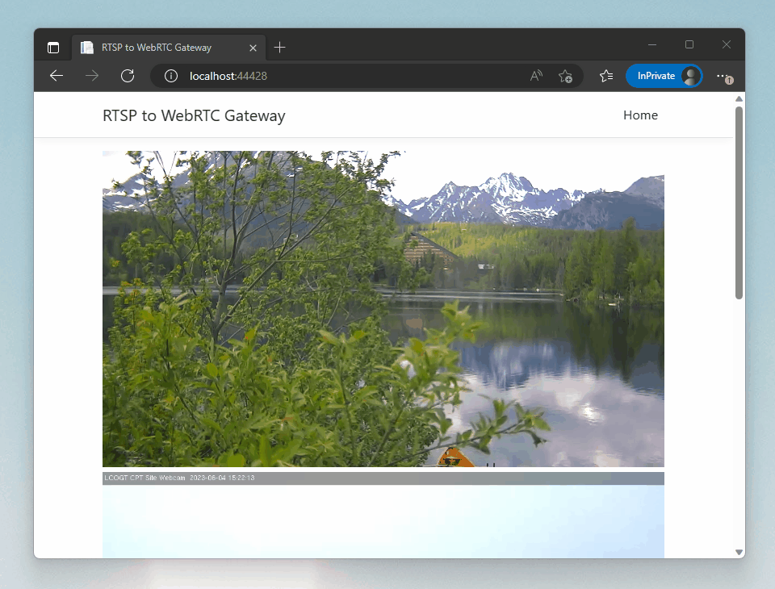

# SharpRTSP to WebRTC
This is a bridge in between RTSP and WebRTC implemented in C#. It can take any H264/H265/AV1 RTSP stream and feed it through WebRTC to the web browser. It does not perform
any video transcoding which makes it lightweight and portable. It does support audio transcoding from AAC to Opus, all implemented in netstandard and NET8 without any native dependencies.

## What can it do?
- Re-stream H264/H265/AV1 RTSP from any source to the web browser
- Stream aggregation - there is only a single session in between the gateway and the RTSP source, no matter how many users are watching the stream
- Transcode AAC audio to Opus with a small latency in audio



## Compatibility
Because no video transcoding is being performed, the web browsers must support decoding of the source video codecs in WebRTC.

### H264
This should be supported by the majority of web browsers as it is among the codecs required by WebRTC. There might be an exception for Firefox on Android according to this: https://developer.mozilla.org/en-US/docs/Web/Media/Formats/WebRTC_codecs.

### H265
Although most of the web browsers today support H265 video decoding, it does not mean H265 will also work in WebRTC. As of April 2025, H265 in WebRTC is supported in the latest releases of Safari. It is also supported in Chrome Canary 136+.

### AV1
Most modern web browsers support AV1 in WebRTC.

## Samples
### RTSPtoWebRTCGateway
There is a sample ASP.NET Core app that demonstrates the functionality on multiple live streams. To change the default configuration, just modify the `appsettings.json`:
```json
"Cameras": [
    {
      "Name": "name1",
      "Url": "rtsp://url1",
      "UserName": "MyUserName",
      "Password": "MyPassword"
    },
    {
      "Name": "name2",
      "Url": "rtsp://url2",
      "UserName": null,
      "Password": null
    }
  ]
```

### Minimal example
Start with the standard "React and ASP.NET Core" project template. In `Program.cs`, add the following piece of code to register the `RTSPtoWebRTCProxyService`:
```cs
builder.Services.AddSingleton<RTSPtoWebRTCProxyService>();
```

Then (optionally) add the configuration of streams from `appsettings.json`:
```cs
builder.Services.Configure<List<CameraConfiguration>>(builder.Configuration.GetSection("Cameras"));
```

Implement a minimal WebRTC signalling controller, for instance:
```cs
[ApiController]
[Route("api/[controller]")]
public class WebRTCController : ControllerBase
{
    private readonly IList<CameraConfiguration> _cameras;
    private readonly RTSPtoWebRTCProxyService _webRTCServer;

    public WebRTCController(IOptions<List<CameraConfiguration>> cameras, RTSPtoWebRTCProxyService webRTCServer)
    {
        _cameras = cameras.Value;
        _webRTCServer = webRTCServer;
    }

    [HttpGet]
    [Route("getcameras")]
    public IActionResult GetCameras()
    {
        return Ok(_cameras.Select(x => x.Name).ToList());
    }

    [HttpGet]
    [Route("getoffer")]
    public async Task<IActionResult> GetOffer(string id, string name)
    {
        return Ok(await _webRTCServer.GetOfferAsync(id, camera.Url, camera.UserName, camera.Password, camera.StartPort, camera.EndPort));
    }

    [HttpPost]
    [Route("setanswer")]
    public IActionResult SetAnswer(string id, [FromBody] RTCSessionDescriptionInit answer)
    {
        _webRTCServer.SetAnswer(id, answer);
        return Ok();
    }

    [HttpPost]
    [Route("addicecandidate")]
    public IActionResult AddIceCandidate(string id, [FromBody] RTCIceCandidateInit iceCandidate)
    {
        _webRTCServer.AddIceCandidate(id, iceCandidate);
        return Ok();
    }
}
```

Finally, for the WebRTC viewer you can refer to `src/rtsptowebrtc.client/src/CameraViewer.jsx`.

### Hosting on a public IP address
It is recommended to use a TURN server such as https://github.com/coturn/coturn when hosting this project on the Internet. 
To host this project on a public IP address without using a TURN server, you will have to configure port ranges (`StartPort`, `EndPort`) for each camera in `appsettings.json`. Then you have to configure port forwarding of all the ports in the configured port ranges to this server + port forwarding for the web application. 
In some cases, you might also want to configure your server public IP address to be included in the ICE candidates. You can use `PublicIPv4` and `PublicIPv6` in `appsettings.json` for this purpose.

## Credits
- sipsorcery - WebRTC implementation in netstandard which has made this project possible https://github.com/sipsorcery-org/sipsorcery
- SharpRTSP - RTSP client https://github.com/ngraziano/SharpRTSP
- concentus - Opus codec implementation https://github.com/lostromb/concentus
